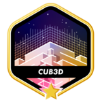

<p align="center">
    
</p>

## Project Overview

Welcome to the `Cub3D` project, inspired by the world-famous historic game "Wolfenstein 3D", which was the first FPS ever. This project aims to recreate a dynamic 3D environment using the principles of ray-casting. The objective is to develop a "realistic" 3D graphical representation within a maze, from a first-person perspective.

## Features

- **Ray-Casting Implementation**: Efficient and accurate ray-casting algorithm to render a 3D maze.
- **Texture Mapping**: Walls are textured, enhancing the visual depth and realism.
- **Sprite Rendering**: Integration of sprites in the environment.
- **Collision Detection**: Solid walls and object interaction.
- **Dynamic Viewpoint**: Player movement and camera control (rotation and linear movement).
- **Map Parsing**: Custom map creation using a basic configuration file.
- **Bonus Features**: Floor and ceiling textures, doors, animations and a mini-map overlay for navigation.

## Installation and Usage

### Prerequisites

- A C compiler (like gcc)
- make
- The MinilibX library

### Compiling the Program

1. Clone the repository:
    ```sh
    git clone https://github.com/Darrens24/Cub3D.git
    ```

2. Enter the directory and compile:
    ```sh
    cd Cub3D
    make
    make bonus
    ```

3. Run the program:
    ```sh
    ./cub3D map_file.cub
    ./cub3D_bonus map_file.cub
    ```

## Controls

- **W/A/S/D**: Move forward/left/back/right.
- **Arrow keys**: Rotate the viewpoint.
- **ESC**: Exit the game.

### Ray-Casting Algorithm

Ray-casting is implemented to calculate the distance to walls and render them correctly. This algorithm was meticulously optimized for performance and accuracy, ensuring a smooth gaming experience.

### Texture Mapping and Sprites

Textures were carefully chosen and applied to walls, floors, and ceilings. Sprite rendering was handled with an emphasis on the correct positioning and scaling relative to the player's viewpoint.

### Collision Detection

A simple yet effective collision detection mechanism ensures that the player does not walk through walls or sprites.

### Map Parsing

The map parsing mechanism is robust, handling various map layouts and textures. This flexibility allows for custom map creation, enhancing the replayability of the game.

## Conclusion

`Cub3D` stands as a testament to the power of ray-casting in creating immersive 3D environments using only 2D maps. It is an excellent example of the graphical capabilities achievable with the C programming language and a deep understanding of computer graphics principles.

